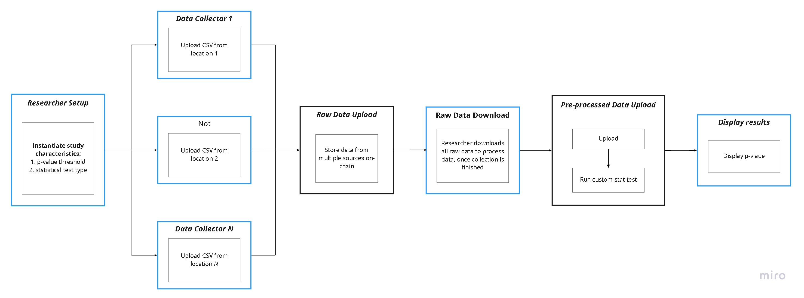

## Clinical Trial Data Use Case
This use case secures the data progression of clinical trial data, using Phala Network's Fat Contract framework to deploy an ink! smart contract. 

## Overview
Clinical trials are conducted in more decentralized manners because 1) patient mobility is restricted during COVID-19, and 2) a higher patient diversity is demanded to increase the generalizability of results. 

The vision of the use case is to support virtual clinical trials, which collect patient data from multiple geographical locations, and secure its data upload, data aggregation, and significance testing processes on-chain. Read more on the proposal [here](./docs/proposal.pdf).

## Architecture and product

### Current state:
1. **The contract can only handle up to 30 patient records [_engineering_]**. 
    <br><br>
    - Working with data and statistics often involves floating-point numbers and some form of pseudo-random sampling under the hood. However, their non-deterministic nature renders them incompatible, since each node in the network needs to be able to independently execute the smart contract and obtain an identitical output, to preserve the integrity of the state of the virtual machine. Consequently, decimal numbers are treated as scaled integers to preserve a fixed number of significant figures, which are de-scaled in the frontend in an unsecured manner. The current statiscal results are also analytically calculated rather than simulated, which involves larger quantities of factorials that risks integer overflow. Hence, 30 patient records is the maximum that does not cause an overflow in the u128 data type. 
    <br><br>
2. **The contract is currently isolated in use [_user experience_].** 
    <br><br>
    - This means each dataset maps to one instantiation of the contract. However, because multiple datasets are separated, for now our frontend cannot handle the display of multiple datasets' statistical results, since the contract loader only pertain to a single contract ID.
    <br><br>
3. **The statistical result is not credibly displayed [_user experience_].** 
    <br><br>
    - Currently, the statistical significance of the data is displayed as a pop-up on the frontend and requires the researcher to do some form of copy-and-paste on the frontend to a journal article, pharmaceutical company website, company report, et cetera. 
    <br><br>

### Goal state:
1. **Use a Rust crate that works with statistics and probability distributions and implements a `no_std` version.** 
    <br><br>
    - Currently, the go-to Rust library `statrs` crate uses many floating-point data types and random processes. This is the most scalable way to include more types of statistical tests into our contract. We can either wait for the `no_std ` release of the `statrs` crate, or try revamp the library on our own by first replacing all floating points with the `fixed-point` data type, a pseudo-floating-point that is deterministic at compile time.
    <br><br>
2. **Implement cross-contract communication and account verification on the backend to handle multiple clinical trial datasets on a single frontend.** 
    <br><br>
    - With this, the current storage of the full dataset needs to reduce to such as the storage of the hash of the dataset, where the full dataset resides in an external decentralized storage like Arweave. This should be similar to use cases that handle accounts of cryptocurrencies or NFTs, where anagously a single dataset is akin to a single NFT.
    <br><br>
3. **More investigation is needed on how best to communicate credibly the result to the desired audience.** 
    <br><br>
    - One way to is to make use of Phala Network Fat Contract's HTTP capabilities to sent statistical results directly to the desired website, such as the FDA's homepage or the pharceutical's blog. 
    <br><br>

## Interact with the contract 
1. Download the code in your desired directory
  ```
  git clone <url>
  ```
2. Build the contract in the root directory. The WebAssembly `.wasm` file will appear in `\target\ink`
  ```
  cargo build --release
  ```
3. Upload the WebAssembly code to Phala Network's PoC test net on the Polkadot/Subtrate portal following this [tutorial](https://www.youtube.com/watch?v=aZGj4FhkY6A&t=3135s&ab_channel=ParityTechnologies). You should obtain your contract ID
4. Build the Next.js frontend in the root directory
  ```
  npm install
  npm build
  ```
5. Run the frontend and input the contract ID and endpoints 
  ```
  npm start
  ```
6. Interact! Here's a [short demo video](https://www.loom.com/share/f4449d23e81545bcabe1085448cc17b0)

## External resources

- [Set up Polkadot development accounts](https://wiki.phala.network/en-us/general/applications/01-polkadot-extension/#create-new-account)
- [Fat Contract tutorial](https://wiki.phala.network/en-us/build/developer/fat-contract-tutorial/)
- [Run a local Phala Blockchain test net tutorial](https://wiki.phala.network/en-us/build/developer/run-a-local-development-network/)

